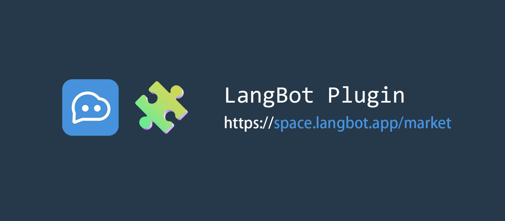

## LangBot Plugin Infra

This repository contains the Runtime, SDK and CLI for LangBot plugins. For usage, principles and tutorials, see the [LangBot Plugin Documentation](https://docs.langbot.app/en/plugin/dev/tutor).

此仓库是 LangBot 插件的运行时、SDK 和 CLI。关于使用、原理和教程，请参阅 [LangBot 插件文档](https://docs.langbot.app/zh/plugin/dev/tutor)。
