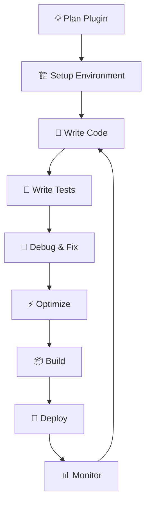

# Development Guide

Welcome to the LangBot Plugin SDK development guide! This section provides comprehensive information for developers who want to create robust, efficient, and maintainable LangBot plugins.

## 📖 Overview

This guide covers:

- 🏗️ **Development Setup** - Configure your development environment
- 📝 **Best Practices** - Follow proven patterns and conventions
- 🧪 **Testing** - Write and run tests for your plugins
- 🐛 **Debugging** - Troubleshoot and fix issues
- 🚀 **Deployment** - Build and publish your plugins
- ⚡ **Performance** - Optimize your plugin's performance
- 🔒 **Security** - Keep your plugins and users safe

## 🎯 Quick Navigation

| Topic | Description | Audience |
|-------|-------------|----------|
| [Setup](setup.md) | Development environment configuration | All developers |
| [Best Practices](best-practices.md) | Coding standards and patterns | All developers |
| [Testing](testing.md) | Testing strategies and frameworks | Intermediate+ |
| [Debugging](debugging.md) | Troubleshooting techniques | All developers |
| [Deployment](deployment.md) | Publishing and distribution | Intermediate+ |
| [Performance](performance.md) | Optimization techniques | Advanced |
| [Security](security.md) | Security best practices | All developers |

## 🚀 Getting Started

### For New Developers

1. **Start Here**: [Development Setup](setup.md)
2. **Learn Patterns**: [Best Practices](best-practices.md)  
3. **Build Safely**: [Security Guidelines](security.md)
4. **Test Your Code**: [Testing Guide](testing.md)

### For Experienced Developers

1. **Review**: [Best Practices](best-practices.md)
2. **Optimize**: [Performance Guide](performance.md)
3. **Deploy**: [Deployment Strategies](deployment.md)
4. **Scale Up**: Advanced patterns and architectures

## 🏗️ Development Workflow

### Recommended Development Process



1. **Plan**: Define plugin requirements and architecture
2. **Setup**: Configure development environment  
3. **Code**: Implement features following best practices
4. **Test**: Write comprehensive tests
5. **Debug**: Fix issues and edge cases
6. **Optimize**: Improve performance and efficiency
7. **Build**: Package for distribution
8. **Deploy**: Publish to marketplace or deploy privately
9. **Monitor**: Track usage and performance
10. **Iterate**: Gather feedback and improve

### Development Tools

#### Essential Tools

- **IDE/Editor**: VS Code, PyCharm, or your preferred editor
- **Version Control**: Git for source code management
- **Package Manager**: pip, poetry, or conda
- **Testing Framework**: pytest for unit and integration tests
- **Debugger**: Python debugger or IDE debugging tools

#### Recommended Extensions

**VS Code Extensions:**
- Python
- Pylance (Python language server)
- Python Test Explorer
- GitLens
- Better Comments

**PyCharm Plugins:**
- Python Community Edition (built-in)
- GitToolBox
- Rainbow Brackets

## 📚 Core Concepts

### Plugin Architecture

```
Plugin Structure:
├── main.py              # Entry point
├── plugin.yaml          # Configuration
├── handlers/            # Event handlers
│   ├── __init__.py
│   ├── message.py       # Message handlers
│   └── command.py       # Command handlers
├── services/            # Business logic
│   ├── __init__.py
│   ├── ai_service.py    # AI integration
│   └── data_service.py  # Data processing
├── utils/               # Utilities
│   ├── __init__.py
│   ├── helpers.py       # Helper functions
│   └── validators.py    # Input validation
├── tests/               # Test suite
│   ├── __init__.py
│   ├── test_handlers.py
│   └── test_services.py
├── requirements.txt     # Dependencies
└── README.md           # Documentation
```

### Design Principles

1. **Single Responsibility**: Each module has one clear purpose
2. **Separation of Concerns**: Separate business logic from UI logic
3. **Dependency Injection**: Use context for accessing APIs
4. **Error Handling**: Graceful failure and recovery
5. **Testability**: Write code that's easy to test
6. **Documentation**: Clear, comprehensive documentation

## 🎨 Code Style Guidelines

### Python Style

Follow [PEP 8](https://www.python.org/dev/peps/pep-0008/) with these additions:

```python
# Good: Clear, descriptive names
async def handle_weather_command(event: CommandEvent, context: PluginContext):
    """Handle weather-related commands."""
    pass

# Good: Type hints
async def process_user_message(message: str, user_id: int) -> MessageChain:
    """Process user message and return response."""
    pass

# Good: Docstrings
class WeatherService:
    """Service for fetching weather information."""
    
    async def get_weather(self, city: str) -> dict:
        """
        Get weather data for a city.
        
        Args:
            city: Name of the city
            
        Returns:
            Weather data dictionary
            
        Raises:
            WeatherAPIError: If API request fails
        """
        pass
```

### Plugin-Specific Conventions

```python
# Event handlers: verb_noun pattern
async def handle_message_received(event, context):
    pass

async def process_command_help(event, context):
    pass

# Service classes: Noun + Service
class UserService:
    pass

class MessageService:
    pass

# Constants: UPPER_CASE
MAX_MESSAGE_LENGTH = 1000
DEFAULT_TIMEOUT = 30

# Configuration keys: lowercase with underscores
config = {
    'api_key': 'your_key',
    'max_retries': 3,
    'debug_mode': False
}
```

## 🔧 Project Structure

### Minimal Plugin

For simple plugins:

```
my-plugin/
├── main.py
├── plugin.yaml
├── requirements.txt
└── README.md
```

### Standard Plugin

For most plugins:

```
my-plugin/
├── main.py
├── plugin.yaml
├── handlers/
│   ├── __init__.py
│   └── messages.py
├── services/
│   ├── __init__.py
│   └── core.py
├── tests/
│   ├── __init__.py
│   └── test_main.py
├── requirements.txt
└── README.md
```

### Complex Plugin

For advanced plugins:

```
my-plugin/
├── main.py
├── plugin.yaml
├── src/
│   ├── __init__.py
│   ├── handlers/
│   │   ├── __init__.py
│   │   ├── messages.py
│   │   ├── commands.py
│   │   └── events.py
│   ├── services/
│   │   ├── __init__.py
│   │   ├── ai_service.py
│   │   ├── data_service.py
│   │   └── api_service.py
│   ├── models/
│   │   ├── __init__.py
│   │   ├── user.py
│   │   └── message.py
│   └── utils/
│       ├── __init__.py
│       ├── helpers.py
│       └── validators.py
├── tests/
│   ├── __init__.py
│   ├── unit/
│   ├── integration/
│   └── fixtures/
├── docs/
│   ├── README.md
│   └── API.md
├── scripts/
│   ├── setup.py
│   └── deploy.py
├── requirements.txt
├── requirements-dev.txt
├── .gitignore
├── .pre-commit-config.yaml
└── pyproject.toml
```

## 🚦 Development Phases

### Phase 1: Planning (📋)

- Define plugin requirements
- Choose architecture pattern
- Plan API integrations
- Design user interface

### Phase 2: Setup (🏗️)

- Initialize project structure
- Configure development environment
- Set up version control
- Install dependencies

### Phase 3: Implementation (💻)

- Implement core functionality
- Add event handlers
- Integrate external APIs
- Handle edge cases

### Phase 4: Testing (🧪)

- Write unit tests
- Add integration tests
- Test error scenarios
- Performance testing

### Phase 5: Documentation (📚)

- Write API documentation
- Create user guides
- Add code comments
- Update README

### Phase 6: Deployment (🚀)

- Build package
- Test in staging
- Deploy to production
- Monitor performance

## 📖 Learning Resources

### Official Documentation

- [API Reference](../api-reference/) - Complete API documentation
- [CLI Reference](../cli-reference.md) - Command-line tools
- [Examples](../examples/) - Practical examples and tutorials

### External Resources

- [Python Official Documentation](https://docs.python.org/3/)
- [Async Programming in Python](https://docs.python.org/3/library/asyncio.html)
- [Pydantic Documentation](https://pydantic-docs.helpmanual.io/)
- [pytest Documentation](https://docs.pytest.org/en/latest/)

### Community

- [GitHub Discussions](https://github.com/langbot-app/langbot-plugin-sdk/discussions)
- [Community Forum](https://community.langbot.app)
- [Discord Server](https://discord.gg/langbot)

## 🤝 Contributing

We welcome contributions to the SDK and documentation!

### How to Contribute

1. **Report Issues**: Use GitHub Issues for bugs and feature requests
2. **Submit PRs**: Follow our contribution guidelines
3. **Improve Documentation**: Help make docs clearer and more complete
4. **Share Examples**: Contribute example plugins and tutorials

### Contribution Guidelines

- Follow existing code style
- Add tests for new features
- Update documentation
- Use clear commit messages

## 📋 Checklists

### Pre-Development Checklist

- [ ] Requirements clearly defined
- [ ] Development environment set up
- [ ] Version control initialized
- [ ] Project structure planned

### Pre-Release Checklist

- [ ] All tests passing
- [ ] Documentation updated
- [ ] Security review completed
- [ ] Performance tested
- [ ] Error handling verified

### Post-Release Checklist

- [ ] Monitor for issues
- [ ] Gather user feedback
- [ ] Plan next iteration
- [ ] Update knowledge base

---

Ready to dive deeper? Choose a topic from the navigation above or start with [Development Setup](setup.md) to configure your environment!